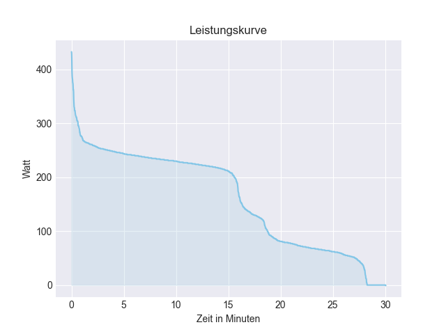

# Programmierübung 2

## Einstieg
Es soll anhand von einer CSV-Datei eine Leistungskurve erstellt und geplottet werden.

### Umgang mit PDM
- Zum aufsetzen eines Projektes einmalig 'pdm init'
- Zum installieren eines Projektes nach dem Klonen 'pdm install'
- Zum hinzufügen eines Pakets 'pdm add <packetname>'

- 'gitignore' legt fest, was von git ignoriert wird. Hier muss __immer vor__ dem ersten Commit der Ordner '.venv/' drinnen stehen.

## Nutzung des Projektes

In ['activity.csv'](activity.csv) liegen die Daten: Daraus wurde diese Graphik erzeugt.

# EKG-Analyse App

## Funktionsumfang

- Die App ermöglicht die Analyse von EKG-Daten,
- Dabei werden folgende Use Cases unterstützt:

### Funktionelle Anforderungen
- [ ] Als Nutzer:in möchte ich eine Versuchsperson auswählen und die relevanten Daten angezeigt bekommen
- [ ] Als Nutzer:in möchte ich mir das Bild einer Versuchsperson anzeigen lassen, um mich zu vergewissern, dass ich die richtige Person anzeige
- [ ] Als Nutzer:in möchte ich die zu einer Versuchsperson gehörenden EKG Datensätze auswählen können 
- [ ] Als Nutzer:in möchte ich die EKG-Daten einer Versuchsperson als Grafik anzeigen lassen 
- [ ] Als Nutzer:in möchte ich mir den Durchschnittspuls einer Versuchsperson als Zahl anzeigen lassen 

## Implementierung (Pflichtenheft - WIE)
### Ablaufdiagramme

Die User Journey wird in einem Ablaufdiagramm dargestellt:

## Anwendung der App
1. Sicherstellen, dass die virtuelle Umgebung aktiviert ist ".venv/Script/activate"
2. Abhängigkeiten installieren `streamlit run main.py`
3. Wählen einer Versuchsperson
4. Eingabe der Herzfrequenz
5. Zonen werden entsprechend der maximalen Herzfrequenz angepasst
6. Anzeige der Zeit und der durchschnittlichen Leistung in den Zonen
7. Anzeige des Leistungs- und Herzfrequenzverlaufs 

### Alternativ
Alternativ kann auch die Datei [run_server.py](run_server.py) ausgeführt werden. (Windows only).

## Bilder der App

